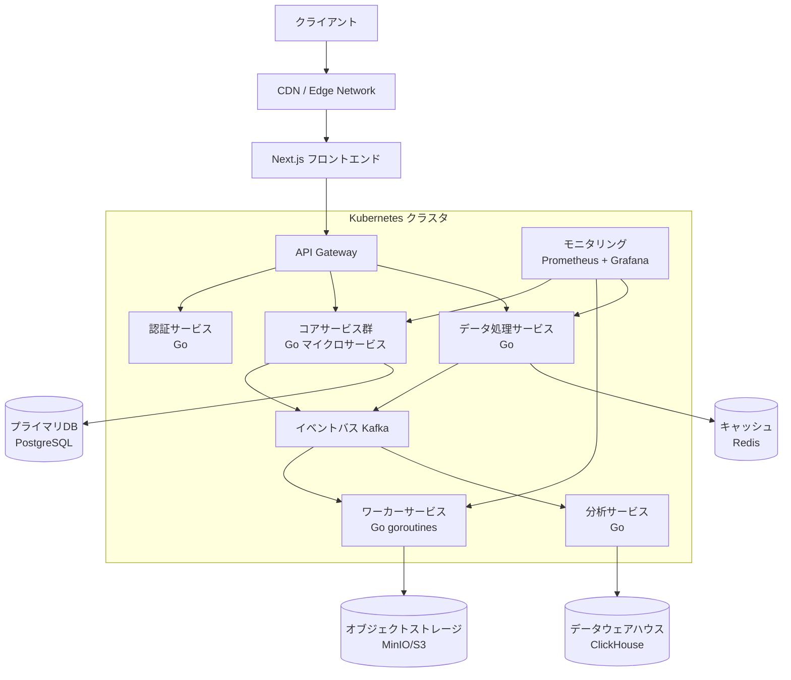

## 全体アーキテクチャ

## 推奨技術スタック

### フロントエンド

- **Next.js**: SSR と SSG の両方のアプローチで高速な UI
- **TypeScript**: コード品質と開発効率向上
- **TailwindCSS**: UI コンポーネント構築の効率化
- **React Query**: サーバーステート管理
- **Zustand**: クライアントステート管理（Redux より軽量）

### バックエンド

- **Go**: 高性能マイクロサービス実装
  - フレームワーク: Gin または Echo （高性能 Web API フレームワーク）
  - ライブラリ: Gorilla Websocket（リアルタイム通信用）
  - GORM: O/R マッパー

### 並列処理・スケーリング

- **Kubernetes**: コンテナオーケストレーション
- **Istio**: サービスメッシュ（トラフィック管理、セキュリティ）
- **Goroutines & Channels**: Go 内部の並列処理
- **Kafka**: 高スループットメッセージングとイベント処理

### データストア

- **PostgreSQL**: プライマリデータベース（水平シャーディング対応）
- **Redis**: 高速キャッシュとレート制限
- **ClickHouse**: 高速な分析データベース
- **MinIO/S3**: オブジェクトストレージ

### インフラ

- **Terraform**: インフラのコード化
- **Helm**: Kubernetes リソース管理
- **Prometheus & Grafana**: モニタリングとメトリクス
- **ELK Stack**: ログ集約と分析
- **Datadog/New Relic**: APM とパフォーマンスモニタリング

### デプロイ・CI/CD

- **GitHub Actions/GitLab CI**: CI/CD パイプライン
- **ArgoCD**: GitOps ベースの Kubernetes デプロイ
- **Docker**: コンテナ化

## 1000 単位の並列処理を実現するポイント

1. **Go 言語の活用**:

   - goroutines とチャネルで効率的な並行処理（10,000 以上の goroutines が単一マシンで実行可能）
   - コンテキストパッケージを使ったタイムアウト・キャンセル処理

2. **非同期処理アーキテクチャ**:

   - Kafka によるタスク分散（耐久性とスループットの確保）
   - イベント駆動アーキテクチャの採用

3. **スケーラブルなデータベース戦略**:

   - 水平シャーディング（テナントごと、リージョンごとなど）
   - 読み取り負荷の分散（リードレプリカ）
   - ホットデータとコールドデータの分離

4. **インフラストラクチャの最適化**:
   - Kubernetes の自動スケーリング（HPA/VPA）
   - リソース制限と要求の最適化
   - ノードアフィニティとポッドアンチアフィニティの設定

このアーキテクチャは 1000 単位の並列処理を十分にサポートでき、さらなるスケールにも対応可能です。実装時には段階的にビルドし、各コンポーネントのパフォーマンスを個別に検証することをお勧めします。
